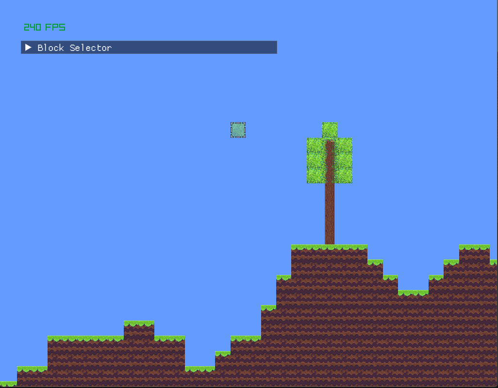

# TERRARIUM

## A c++ imitation of terraria
A terraria inspired game made in C++ made while following a game development course.

---

### Features
* Basic Camera Movement (FreeCam / Debug Camera)
* Seeded procedural world generation
* Breaking and Placing Blocks

---

## TODO
- [X] Game Window
  - [X] Basic Camera Movement
- [ ] Player
- [ ] World
  - [X] Seeded procedural world generation
  - [ ] Seeded Noise based World Gen
  - [ ] Add Walls Layer
- [ ] Update Loop
  - [ ] Separate Logic Updates from Rendering
  - [ ] Tick system for world updates
- [ ] Rendering
  - [X] Camera Culling / Frustum Culling
  - [ ] Dynamic texture system for adjacent tiles 
- [ ] Entities
  - [ ] NPCS
  - [ ] Enemies
- [ ] Inventory
